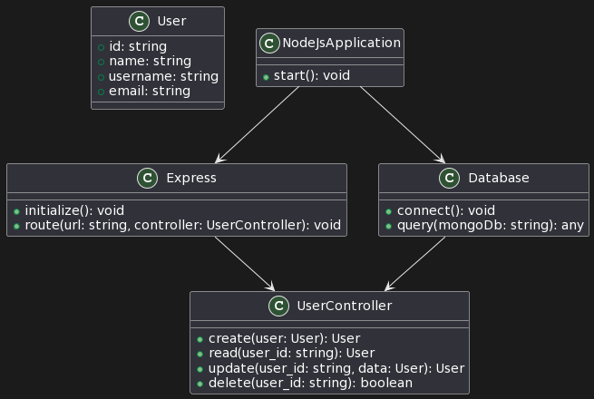

# HNGx Internship Program

**HNGx helps to nurturing talent, fostering innovation, and empowering the next generation of tech professionals.**

<p>The HNG Internship is a large-scale, fast-paced virtual internship for people learning code and design. It's intended for early junior developers/designers who have already completed a training program or have basic knowledge. </p>

---

---

## This is Stage Two Project

<p> A simple REST API capable of CRUD operations on a "person" resource, interfacing with any database of my choice. Your API will dynamically handle parameters, such as adding or retrieving a person by name. Accompany the development with UML diagrams to represent the system's design and database structure. <br>
 
 The App is hosted on [render](https://render.com)

 </p>

 ---

 This the UML image for the APP




---
---


## API Documentation

- **POST  Add Person**

    - endpoint
```sh
https://hngx-stage-two-411y.onrender.com/v1/api/person
```
A POST request to add PERSON to the DB. 


```
"name": "Janet",
"username": "Okin",
"email": "janetOkon@gmail.com"
```
---
- **PUT Update Person**
```
https://hngx-stage-two-411y.onrender.com/v1/api/person/:user_id
```
A PUT request to update the person in the DB.

```
    "name" : "tunddeee",
    "username": "tundex1",
    "email": "tundex1@gmail.com"
```

---
- **DELETE Delete person**
```
https://hngx-stage-two-411y.onrender.com/v1/api/person/:user_id
```

A DELETE request to delete User by ID

---
- **GET Get a person**
```
https://hngx-stage-two-411y.onrender.com/v1/api/person/:user_id
```
A GET request to get a single user by it ID

---
- **GET Get All users**
```
https://hngx-stage-two-411y.onrender.com/v1/api/persons
```
A GET request to fetch all users

---

### MONGODB is use for the DATABASE

---

The APP hosted [url](https://hngx-stage-two-411y.onrender.com)


---

**One  of the take of the projject is the usage of mongooge Schema property. find and findOne.**

I initially used Person.find({name, email}) but I'm the desiredable response.  <br>
<br>
Why: The **find** method in Mongoose doesn't return null when no documents are found; it returns an empty array. As a result, the conditional check if (foundPerson) will always be truthy, even if no person with the given username and email exists.

I have two solution 
```
1.
 const foundPerson = await Person.find({ username email });

    if (foundPerson.length > 0) {
      return next(createError(400, "Username or email already exist!!!"));
    }
2.  
    const foundPerson = await Person.findOne({username, email});
    if (foundPerson) {
      return res.status(400).json({ message: "Username or email already exists!!!" });
    }

I used the second option. 
```


